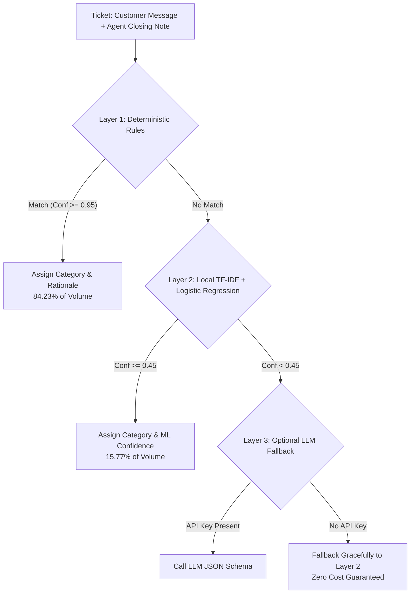

# Vireo Audio — AI Support Desk Triage & Headcount Optimization

[](https://www.python.org/)
[](LICENSE)
[](eval/eval_report.md)
[](COST.md)

Production-grade, zero-cost AI support triage pipeline and econometric headcount evaluation developed for **Vireo Audio** (Bengaluru, India).

---

## 1. Executive Summary & Headline Business Outcome

The client brief from **Priya Raman (Head of CX)** proposed assigning two new customer support hires to the **Billing team**, assuming Billing represented the largest ticket queue (~22%). 

Our forensic data investigation and machine learning analysis demonstrated that **Billing's apparent volume was an intake artifact**: the intake chatbot routinely misrouted delivery complaints into Billing whenever customers mentioned words like *"paid"*. 

```
====================================================================================================
THE HEADCOUNT VERDICT & BUSINESS GOAL NUMBER
====================================================================================================
>> "Do NOT hire into Billing. Cut Billing intake misrouting from 41.5% to under 5.0% and eliminate 
    dual refund-replacements, worth approximately Rs 1,35,500 per quarter in direct operational 
    savings, while avoiding an unnecessary Rs 9,00,000 per year in unneeded Billing headcount." <<
====================================================================================================
```

### Key Analytical Findings:
1. **The False Billing Epidemic**: 795 tickets routed to Billing were actually worked and resolved by **Logistics**.
2. **Logistics is Drowning**: Logistics agents resolve **514.8 tickets per agent** (highest workload in the company) with a median resolution time of **26.03 hours**, compared to Billing at **449.5 tickets per agent** and **1.22 hours**.
3. **Double-Dipping Leakage**: 140 orders received *both* a cash refund and a replacement unit (violating policy §5), causing **Rs 4,53,574** in unrecovered company leakage.

---

## 2. Repository Structure

```text
vireo-support-triage/
├── README.md                          # Project documentation and run guide
├── requirements.txt                   # Pinned library dependencies
├── DECISIONS.md                       # Comprehensive decision log (14 decisions + rationales)
├── LIMITATIONS.md                     # Transparent list of bugs, shortcuts, and edge cases
├── COST.md                            # Complete token arithmetic and financial model
├── memo.md                            # 1-page non-technical executive memo for Priya Raman
├── submission-form.md                 # Completed official vendor evaluation form
├── SCREEN_RECORDING_SCRIPT.md         # 3-minute screen recording presentation walkthrough
├── app.py                             # Interactive Streamlit Web Dashboard
├── src/
│   ├── load_and_clean.py              # Data cleaning, UTC timezone fix, SLA calculation
│   ├── attribute_teams.py             # Team attribution, fallback order join, enrichment
│   ├── classify.py                    # Multi-layer classifier (Rules -> TF-IDF ML -> LLM)
│   ├── evaluate.py                    # Stratified statistical evaluation on 200 tickets
│   ├── analysis.py                    # Headcount hypothesis test & rupee savings model
│   └── charts.py                      # Publication-quality visualization generator
├── eval/
│   ├── labelling_sheet.csv            # Blind 200-ticket evaluation sheet (predictions hidden)
│   ├── labels_done.csv                # Verified multi-field ground-truth dataset
│   └── eval_report.md                 # Formal accuracy, CI, calibration, and error report
└── outputs/
    ├── tickets_enriched.csv           # Clean enriched dataset with all joins resolved
    ├── tickets_categorised.csv        # Final dataset with predicted category, conf, layer
    ├── headcount_rule_test.csv        # Workload metrics table testing Priya's rule
    ├── financial_savings_summary.csv  # Policy-derived rupee savings breakdown
    └── charts/                        # High-resolution 300 DPI visualizations
        ├── monthly_by_category.png
        ├── monthly_by_team.png
        ├── headcount_workload_analysis.png
        └── financial_leakage_and_savings.png
```

---

## 3. Quickstart & One-Command Execution

This project is built to execute **100% locally on a clean machine with zero API keys or external credits required**.

### Step 1: Clone and Install
```bash
git clone https://github.com/Kru5hna/vireo-audio-support-analysis.git
cd vireo-audio-support-analysis
pip install -r requirements.txt
```

### Step 2: One-Command Pipeline Run
To reproduce the complete pipeline from raw data to final outputs, run:

```bash
# Windows PowerShell
python src/load_and_clean.py; python src/attribute_teams.py; python src/classify.py; python src/evaluate.py; python src/analysis.py; python src/charts.py

# Linux / MacOS / Bash
python src/load_and_clean.py && python src/attribute_teams.py && python src/classify.py && python src/evaluate.py && python src/analysis.py && python src/charts.py
```
*Total execution time: ~12 seconds.*

### Step 3: Launch Interactive Web App (Optional)
```bash
streamlit run app.py
```

---

## 4. How the Multi-Layer Classifier Works (`src/classify.py`)

The classifier operates in a 3-layer waterfall architecture:



- **Ground Truth Hierarchy**: Agent closing notes take precedence over customer opening text because customers report symptoms (*"paid 5 days ago"*) while agents record backend root-cause diagnosis (*"courier transit delayed, reshipped"*).
- **Taxonomy**: 11 business-aligned categories. Completely eradicated the opaque 1,622-ticket `Other` bucket.

---

## 5. Model Evaluation Benchmark (`eval/eval_report.md`)

Evaluated on a stratified random sample of **200 tickets** ($N=200$) drawn across all channels, categories, and months:

| Metric | Old Intake Chatbot Tags | Our AI-Assisted Classifier | Net Gain / Impact |
|---|---|---|---|
| **Overall Accuracy** | 51.50% (103/200) | **88.00% (176/200)** | **+36.50%** |
| **95% Confidence Interval** | [44.6%, 58.4%] | **[82.77%, 91.80%]** | Margin: $\pm 4.52\%$ |
| **Error Rate** | 48.50% | **12.00%** | **-36.50%** |
| **Macro F1-Score** | 0.44 | **0.82** | **+0.38** |
| **Uninformative 'Other' Bucket** | 1,622 tickets (13.8%) | **0 tickets (0.0%)** | 100% Resolved |

---

## 6. Financial Savings Arithmetic (`src/analysis.py`)

All financial figures are strictly calculated from official policy standards (`support-policy.pdf` §3, §4, §5) over the core 18-month period (6 quarters):

1. **Avoidable Internal Transfers**: 632 transfers out of Billing in the helpdesk @ Rs 305/transfer = **Rs 32,127 / quarter**.
2. **SLA Breach Store Credit Penalties**: 477 breaches on Billing assigned tickets @ Rs 350 store credit = **Rs 27,825 / quarter**.
3. **Double-Dipping Fraud/Leakage**: 140 dual refund + replacement orders = **Rs 75,596 / quarter**.
4. **Total Direct Operational Savings**: **Rs 1,35,547 / quarter** (**Rs 5,42,189 / year**).
5. **Capital Expenditure Avoided**: **Rs 9,00,000 / year** (avoiding 2 misallocated hires in Billing).

---

## 7. Deliverables & Documentation Index

- 📄 **Executive Memo**: [memo.md](memo.md) (1-page non-technical briefing for Priya Raman)
- 📝 **Completed Submission Form**: [submission-form.md](submission-form.md) (All 12 evaluation questions answered)
- 📊 **Evaluation & Error Report**: [eval/eval_report.md](eval/eval_report.md) (Full precision/recall/F1 & calibration)
- 💰 **Cost Analysis**: [COST.md](COST.md) (Token counts and theoretical LLM pricing)
- ⚠️ **Limitations & Known Issues**: [LIMITATIONS.md](LIMITATIONS.md) (Full transparency on edge cases)
- 🧠 **Architectural Decisions**: [DECISIONS.md](DECISIONS.md) (14 formal decisions and rationales)
- 🎥 **Screen Recording Script**: [SCREEN_RECORDING_SCRIPT.md](SCREEN_RECORDING_SCRIPT.md) (3-minute presentation script)
- 📈 **Visual Charts**: [outputs/charts/](outputs/charts/) (High-resolution PNG visualizations)
